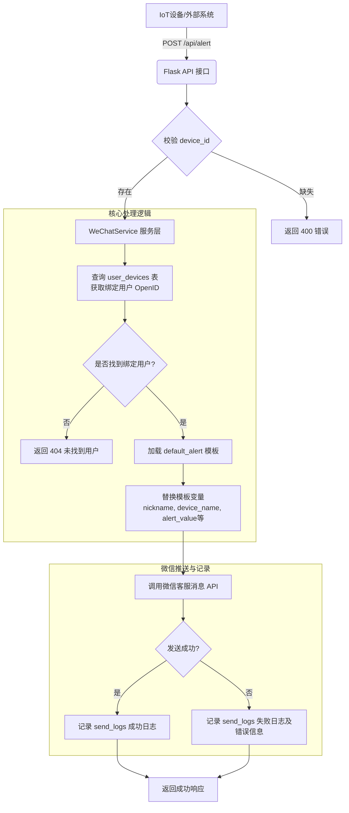

# 微信设备告警推送系统 (WeChat Device Alert System)

一个基于 Flask 和企业微信 API 构建的智能设备监控与消息推送系统。该系统能够接收来自 IoT 设备的告警数据，通过企业微信自动推送给绑定的用户，同时支持定时消息、手动推送及用户管理等功能。

## 📋 项目简介

本项目旨在解决物联网设备状态监控与即时通知的问题。通过将设备与微信用户进行绑定，当设备触发告警（如温度过高、数值异常等）时，系统会自动通过企业微信向设备负责人发送实时通知。此外，系统还内置了定时任务调度器，支持每日报表、定期提醒等场景。

### 核心功能
- 🚨 **设备告警推送**：接收设备 HTTP 请求，自动解析并发送给绑定用户。
- 👥 **用户与设备管理**：支持微信用户关注同步，以及用户与设备的多对多绑定关系。
- ⏰ **定时任务调度**：基于 APScheduler，支持定时发送消息（如每日健康报告）。
- 📊 **简易管理后台**：提供 Web UI 查看统计信息、手动发送测试消息及同步用户。
- 📝 **消息模板系统**：支持自定义消息模板，实现灵活的告警内容格式化。

## 🚀 安装依赖

### 环境要求
- Python 3.8+
- SQLite 3

### 安装步骤

1.  **克隆项目**

```bash
git clone <your-repository-url>

cd wechat-alert-system
```

2.  **创建并激活虚拟环境（推荐）**
```bash

python -m venv venv

source venv/bin/activate  # Linux / macOS

# 或

venv\Scripts\activate     # Windows
```

3.  **安装 Python 依赖包**

根据项目代码，您需要安装以下核心库：
```bash
pip install flask requests apscheduler
```

或者使用 `requirements.txt` 文件一键安装：

```bash
pip install -r requirements.txt
```

## 🏃‍♂️ 快速开始

### 1. 环境配置
在项目根目录创建 `.env` 文件或设置环境变量，填入您的企业微信凭证：
```bash

export WECHAT_APPID="企业微信AppID"

export WECHAT_APPSECRET="企业微信AppSecret"

export SERVER_URL="https://your-domain.com"  # 用于微信回调验证
```
### 2. 启动服务
运行 `app.py`，程序会自动初始化数据库并启动 Flask 服务。
```bash
python app.py
```
启动成功后，终端将显示：
```
==================================================

微信自动推送系统启动成功！

管理后台: http://localhost:5000/admin
```
### 3. 模拟设备告警 (核心功能演示)
打开一个新的终端窗口，使用 `curl` 命令模拟一台设备（例如 `device-001`）发送告警请求：
```
bash

curl -X POST http://localhost:5000/api/alert\

-H "Content-Type: application/json" \

-d '{

"device_id": "device-001",

"level": "严重",

"detail": "温度传感器异常",

"value": "85°C"

}'
```
**预期响应：**
如果设备已绑定用户，系统会返回发送结果：
```
json

{

"code": 200,

"msg": "已向 1 个用户发送告警",

"data": [{"openid": "...", "nickname": "...", "result": {...}}]

}
```
此时，绑定的微信用户将收到如下格式的告警消息：
```
【设备告警】

用户：张三

设备：车间A温控器 (device-001)

级别：严重

详情：温度传感器异常

数值：85°C

时间：2026-05-21 10:30:00

请及时处理！
```

## 🔄 工作流程

### 设备告警推送流程
当 IoT 设备发生异常时，系统通过以下流程自动完成微信消息推送：


### 简要说明
1.  **接入**：设备端通过 HTTP POST 请求 `/api/alert` 接口上报异常数据。
2.  **匹配**：后端根据 `device_id` 在数据库中查询所有绑定的微信用户 (`user_devices` 表)。
3.  **渲染**：系统加载预设的文本模板 (`message_templates` 表)，并将设备数据动态填充到模板中。
4.  **推送**：通过微信公众号的“客服消息接口” (`message/custom/send`) 将消息实时推送到用户微信。
5.  **追溯**：无论成功与否，所有发送行为都会记录在 `send_logs` 表中，便于后续审计和排查问题。